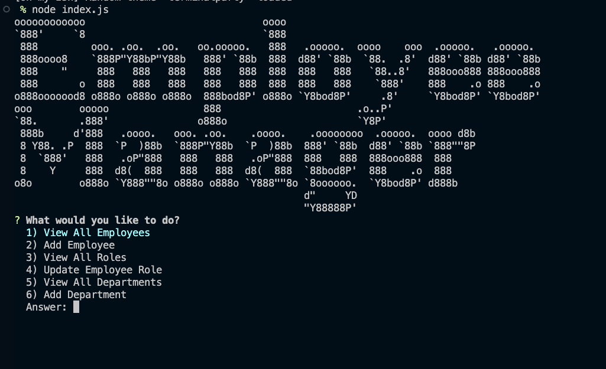
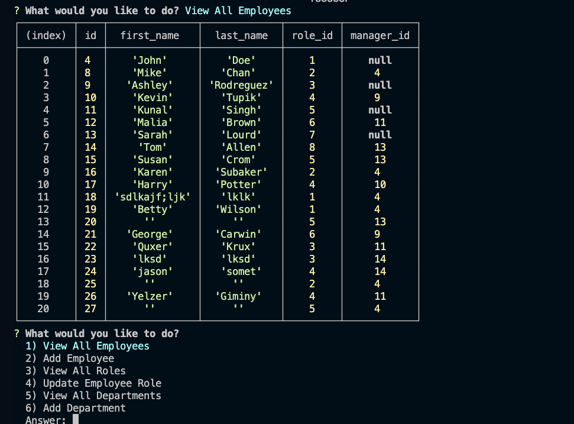
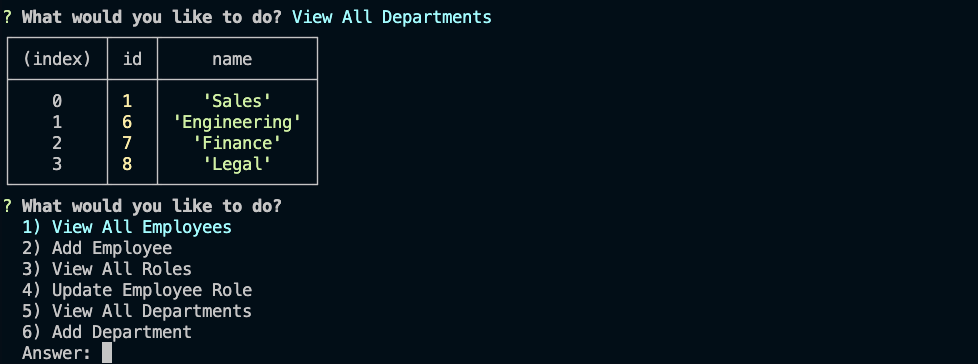
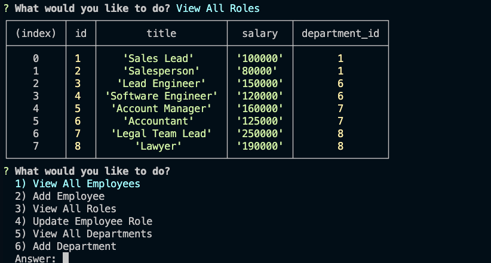
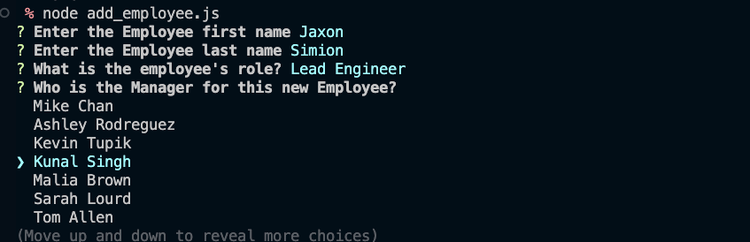

# Employee Tracker
This application is to help manage viewing, adding, deleting or changing Employee and Company information in a Database


## Description and Motivation
The Employee Tracker is meant to give someone an easy to use, straightforward method for keeping track of employes, their managers, and departments within Company ZXY. It is as basic as you can get to add employee information into a database and easily view the details of who their managers are, salaries they have and departments they are in. As a commandilne interface, the app can be started in an instant.

Here is the opening page for what you will see



## Usage

In order to use this appliation, there are a couple of setups you will need to do.
- First, run the command
    - npm install
    - this wil install all of your dependancies you will need for this application to run.
- Execute the schema.sql and seed.sql in a mysql shell
    - basically, start up mysql -u root -p (add password and so on)
    - then copy-past schema first to create the database, and
    - then copy-past the seed.sql in and it will populate some data into thedb.
- Run the application with the following command
    - `node index.js`

Now you can scroll up and down the menu to view employees, roles, departments and (theoretically) add/delete users.
However, this functionality is not really ready at this time in the script it is in. I had to move addEmployee to its own script to add. It works.
Thus, in order to add an employee at this time, you will need to exit this screen, and then run the following:
- node add_employee
This will take you to a really sweet menu to add the employee. it was not ready to go into the main program yet.


## Table of Contents

* [Technology Used](#technology-used)
* [Repo Location](#repo)
* [Screenshots of Application](screenshots-of-application)
* [Learning Points](#learning-points)
* [Code Snippets](#code-snippets)
* [Contact Info](#contact-info)

## Technology Used 

| Technology Used         | Resource URL           | 
| ------------- |:-------------:| 
| Git | [https://git-scm.com/](https://git-scm.com/)     |    
| NPM and ExpressJs | [https://www.npmjs.com/package/express](https://www.npmjs.com/package/express)|
| NPM Mysql2 | [https://www.npmjs.com/package/mysql2](https://www.npmjs.com/package/mysql2)|
| NodeJs | [https://nodejs.org/en](https://nodejs.org/en)|
| ChatGPT | [https://openai.com/blog/chatgpt](https://openai.com/blog/chatgpt)|

There is also javascript, Google Search, and Youtube university. 

## Repo and Link to View functionionality

[https://github.com/flimits/employee-tracker](https://github.com/flimits/employee-tracker)

Here is a link to the video that was taken to show you the process I used to run this application.
[Video of Employee Tracker](https://watch.screencastify.com/v/cHMkiK8JbEguJUIwhEiY)


## Screenshots of Application
---
I have multiple screenshots to show the implimentation of this application and what it looks like.

### Here is the opening page.

---
---
### Here is to view all employees, then Deplartments, and lastly Roles

---


---


---
---
### Now wee see what it looks like when running the add user

---
---


## Learning Points 

At first, the proces of viewing the database and adding the employees was realitivley straight forward. I did end up runnign my code though things that would check for issues, but the code and its thought process are mine. I learned that I'm using inquirer wrong, as it would get stuck when trying to present the add-user, which is unfortunate, because that was a pride and joy. IT runs as a stand-alone app just fine.

Als olearned that if you get stuck long enough, move on and finish the rest, which I did not sadly.

## Code Snippets

There are two main parts to this setup from my point of view 
1 setup of the expressjs server and
2 setting up the ability of the server to update a file with a new note.


- Here is the inquirer statement for choices to make with adding/view/edit employees
```js
  const choices = [
        "View All Employees",
        "Add Employee",
        "View All Roles",
        "Update Employee Role",
        "View All Departments",
        "Add Department"
    ];

    inquirer
        .prompt([
            {
                name: "choice",
                message: "What would you like to do?",
                type: "rawlist",
                choices: choices,
            },
        ])
        .then((data) => {
            doWork(data.choice);
        });
    }
    
    function doWork(choice){

    
    if (choice === "View All Employees") {
        viewAll("employee", (err, results) => {
            goAskTheQuestions(); // Continue prompting after viewing data
        });
    } else if (choice === "Add Employee") {
```

- Here is the code the will write the data to the notes db file. It basically take the note that was just created on the web page and then updates the notes database file with it by first reading in the whole file, then appending to the end of it. 
```js
    // Get current notes to parse them.
    fs.readFile('./db/db.json', 'utf8', (err, data) => {
        if (err) {
            console.error(err);
        } else {
            const notesDb = JSON.parse(data);

            // Let's add a new note
            notesDb.push(newNote);

            db.push(newNote);

            // Update the note db with latest note added.
            fs.writeFile(
                './db/db.json',
                JSON.stringify(notesDb, null, 4),
                (writeErr) =>
                    writeErr
                        ? console.error(writeErr)
                        : console.info('Successfully updated note!')
            );
        }
    });
    ```
---
### Using the require statement in node.js

Needed to add some require statements to the package.json and index.js

const inquirer = require('inquirer');
const db = require('mysql2');

This helped to allow the app to make choices on how I should manage the employ and access the dabase.


## Contact Info

| Name      |Email      | Github    | Portfolio |
|-----------|-----------|-----------|-----------|
|Jason       |flimits@gmail.com|https://github.com/flimits|https://github.com/flimits/my-portfolio/|


## Psuedo Code

The below was a psuedo coding exercise I did with others in order to come up with an attack plan of our to build the final touches on the Note-Taker application. 

### From the course story of what is required

* GIVEN a note-taking application
* WHEN I open the Note Taker
* THEN I am presented with a landing page with a link to a notes page
* WHEN I click on the link to the notes page
* THEN I am presented with a page with existing notes listed in the left-hand column, plus empty fields to enter a new note title and the note's text in the right-hand column
* WHEN I enter a new note title and the note's text
* THEN a "Save Note" button and a "Clear Form" button appear in the navigation at the top of the page
* WHEN I click on the Save button
* THEN the new note I have entered is saved and appears in the left-hand column with the other existing notes and the buttons in the navigation disappear
* WHEN I click on an existing note in the list in the left-hand column
* THEN that note appears in the right-hand column and a "New Note" button appears in the navigation
* WHEN I click on the "New Note" button in the navigation at the top of the page
* THEN I am presented with empty fields to enter a new note title and the note's text in the right-hand column and the button disappears

### Psuedo code part

* import express module to our server
* import require("./db/db.json")
* create app variable pointing to new express object(express())
* app.use(*middleware*){ -json, urlencoded, staticify(public)}
* 
* get/delete/post requests:
* 
* get request to send index.html, route: '/'
* get request to send notes.html, route: '/notes'
* 
* get request to fetch our api to send notes from db.json, route: '/api/notes'
* post request to fetch our api to modify with parsed req.body data and push post to db.json with fs.writeFile, route: '/api/notes', return res.json;
* delete request to delete specific note, *EXTRA CRED* remove specific data from db.json and push with fs.writeFile,  route: '/api/notes/:notes_id', return res.json;
* app.listen## Psuedo Coding Exercise

* Create repo with the following:
* Nodejs package.json that include inquirer 8.2.4 and mysql. 
* Create a server.js file that include the whole setup for express (even though there might not be a website.)
* Create a video of the exercise for viewing, adding, updating employee information.
* create commandline options: view all departments, view all roles, view all employees, add a department, add a role, add an employee, and update an employee role

- all departments
    - formatted table showing department names and department ids
- view all roles
    - job title, role id, the department that role belongs to, and the salary for that role
- view all employees
    - formatted table showing employee data, including employee ids, first names, last names, job titles, departments, salaries, and managers that the employees report to
- add a department
    - prompted to enter the name of the department and that department is added to the database
- add a role
    - prompted to enter the name, salary, and department for the role and that role is added to the database
- add an employee
    - prompted to enter the employee’s first name, last name, role, and manager, and that employee is added to the database
- choose to update an employee role
    - prompted to select an employee to update and their new role and this information is updated in the database

* I will need to create a company name for the database, that has
* 3 tables: department, employees and roles.
* There will need to be links in the employee tables for employee department to point to department.
* followed by link for employee role to be lined to associated roles table.
* A link for the employee department to point to associated department table.
* Create some kind of id for each employee that can be referenced in the departments, roles and/or employee tables.
